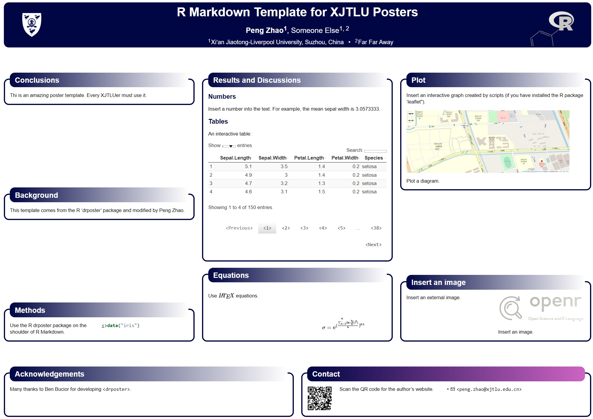

```{r setup, include=FALSE}
knitr::opts_chunk$set(
  echo = TRUE,
  fig.path = "inst2/image/",
  warning = FALSE
)
```

# Installation

```r
remotes::install_github("pzhaonet/xjtlu")
remotes::install_github("pzhaonet/drposter")
install.packages("xaringan")
```


# Load

```{r, message=FALSE}
require("xjtlu")
```

# Functions

## Get full name of an abbreviation

```{r}
get_fullname("XJTLU")
get_fullname(c("XJTLU", "ENV", "HoD"))
```

## Plot a campus map of XJTLU

```{r map}
# in Chinese
get_map()

# in English
get_map(english = TRUE)
```

## XJTLU poster template

RStudio: File - New File - R Markdown - From Template - XJTLU poster



## XJTLU slides template

RStudio: File - New File - R Markdown - From Template - XJTLU slides


# License

Copyright [Peng Zhao](http://pzhao.org).

Released under the GPL-3 license.
